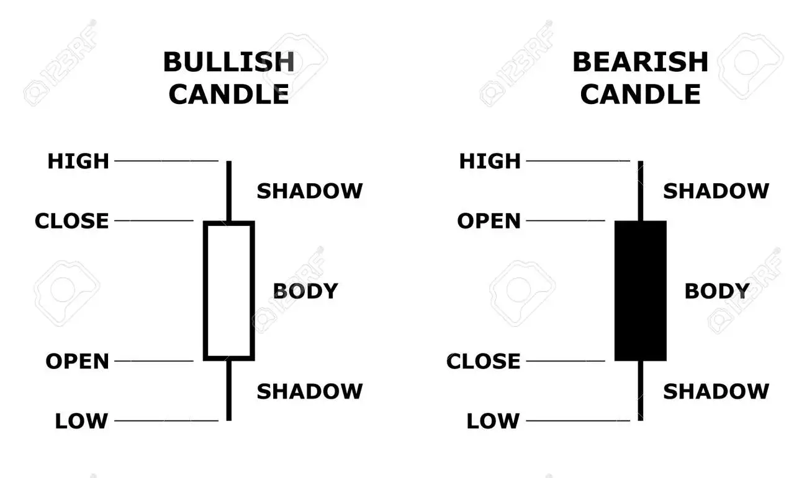

# Technical Analysis

- **probabilistic** forecasts of future price behaviour based on price history
- risk management tool

## Candlestick Charts

### OHLC
- **O**pen
- **H**igh
- **L**ow
- **C**lose

useful for mapping out weekly open, daily open, high/low of the day, precise high/low of a given move, whether price closed through a level or swing point

### Timeframes

time period that one candle represents

beginners should focus on higher time frames (daily D1, hourly H1) to not get caught up in the noise

### Candlestick Patterns

impt:
- swing high/swing low
- doji
- shooting star/hammer
- engulfing
- tweezers

[cheat sheet](https://www.babypips.com/learn/forex/japanese-candlesticks-cheat-sheet)

don't disregard timeframes and trade any patterns - look for htf, clear patterns *where it makes sense to do so*. context is impt - pay attention to reversal pattern where there is a strong trend

:::tip

- **USE HIGHER TIME FRAMES**
- **ZOOM OUT**

:::

## Risk Management

### General Remarks

- survival is the priority
- never risk your ability to take risk

### Invalidation

evidence that suggests the probability of an idea coming to fruition is reduced such that the risk is no longer justified

:::tip

Invalidation always closely tied to the idea itself

:::

types of invalidation:
- priced-based
- time-based
- volatility-based

### Stop Losses I

a stop loss is a order (often a market order) to fully close a position at a certain price or loss threshold

- market order: guaranteed execution, fill price may be unfavourable
- limit order: if it 'skips' your price and the market teleports, you're fucked
- not all trades have an obv stop loss

stop loss placement
- where setup obv calls for it (clear invalidation)
- idea is obv wrong if price trades to the stop order

### Stop Losses II

- stop placement inextricably linked with the trade idea itself (shit idea = shit stop placement)
- if you don't know where to put a stop, that often means the idea itself is not defined very clearly or that the setup isn't particularly good
- simple eye test: would i want to buy where my long gets stopped out / would i want to sell where my short gets stopped out? if yes, consider revising

### Stop Losses III

- strictness with stop usage and placement inversely correlated with the size of the move you're trying to trade
- hard stop
	- for clearly defined setups
	- market order to fully close
- soft stops
	- 'mental' stop, mix of market and limit orders if invalidation criteria begins to be satisfied
	- for swing trades
- use hard stops for beginners
- read [trading riot risk management blog post](https://tradingriot.com/risk-management/)

